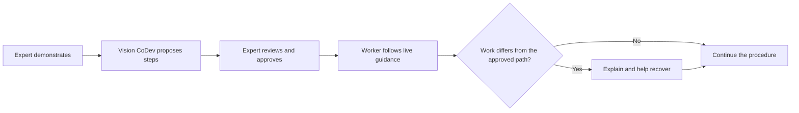
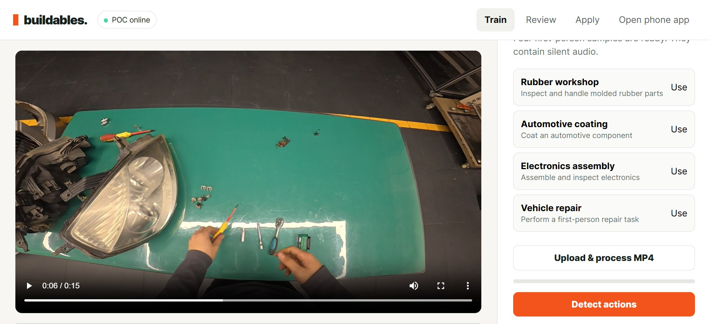
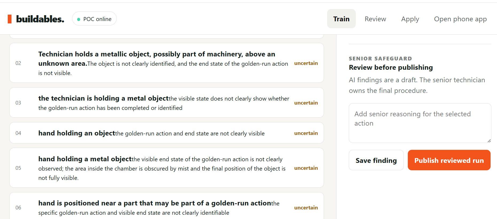
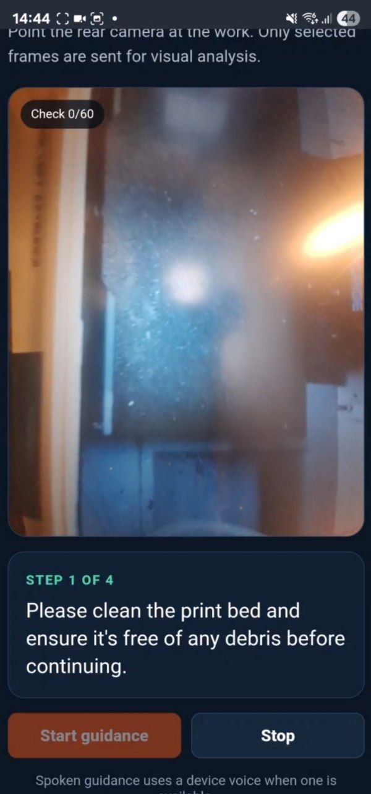

# Vision CoDev

**Turn expert know-how into guidance people can follow in the real world.**

Vision CoDev is a working visual guidance platform for hands-on work. It helps
organizations capture how an experienced person performs a procedure, turn
that demonstration into a reviewable set of steps, and guide another person
through the approved process while the work is happening.

The goal is straightforward: make valuable practical knowledge easier to
preserve, teach, and repeat—without expecting every worker to have an expert
standing beside them.

> This is the public information repository for Vision CoDev. The product's
> source code, infrastructure, models, credentials, and internal engineering
> documentation are maintained privately and are not included here.

## The problem

Many important procedures live mainly in the experience of a small number of
people. Written instructions help, but they can miss the details that experts
perform almost automatically: the correct angle, order, position, timing, or
visual sign that something is wrong.

This creates familiar problems:

- Training takes significant expert time.
- Procedures are performed differently across people and locations.
- Knowledge can leave when experienced staff move on.
- Traditional manuals are difficult to use while both hands are occupied.
- Mistakes may only be discovered after a task is completed.

Vision CoDev explores a more practical form of knowledge transfer: learn from a
reviewed demonstration, then provide timely assistance during the real task.

## The core idea: a Golden Run

A **Golden Run** is a recording of an approved expert performing a task
correctly. Vision CoDev uses that recording as the evidence behind a reusable
procedure.

The expert remains the authority. Automated analysis can help organize the
recording and identify useful moments, but it does not silently turn a guess
into an approved work instruction.

## What the experience provides

1. **Capture** — an experienced person records a correct procedure using a
   practical camera setup.
2. **Structure** — the recording is organized into suggested steps linked back
   to the relevant visual evidence.
3. **Review** — an authorized reviewer corrects, clarifies, and approves the
   procedure.
4. **Guide** — a worker receives step-by-step visual or spoken guidance while
   carrying out the task.
5. **Recover** — when the observed work appears to depart from the approved
   path, the system can pause, explain, and guide the worker toward a reviewed
   recovery path.
6. **Improve** — reviewed outcomes can help an organization refine its
   procedures over time.

## Product in action

### Train from real work

An expert's recorded procedure is processed into a structured Golden Run with
actions that can be reviewed and reused.

### Review before publishing

Detected actions remain reviewable. A senior technician can inspect uncertain
findings, add expert reasoning, and control what becomes a published procedure.

### Guide the worker live

The mobile experience keeps the camera on the work and presents the current
approved step with spoken guidance controls.

  

## Where it helps

Vision CoDev is built for repeatable physical work where consistency, training,
and knowledge retention matter, including:

- equipment setup and maintenance;
- manufacturing and assembly;
- field service and installation;
- inspection and quality workflows;
- laboratory and technical procedures; and
- onboarding for unfamiliar equipment.

The same underlying idea can apply across industries, but every deployment must
be evaluated for its environment, risks, policies, and users.

## Slightly technical overview

At a high level, Vision CoDev connects four capabilities:

- **Visual capture** records the expert demonstration and the later guided task.
- **Procedure intelligence** proposes meaningful steps and connects each step
  to supporting moments in the recording.
- **Human review** creates a controlled, versioned procedure rather than relying
  on unreviewed machine output.
- **Live guidance** compares current progress with the approved procedure and
  selects the next instruction or an approved recovery response.

This repository describes the system at a public product level. See
[How Vision CoDev works](docs/HOW-IT-WORKS.md) for more detail without exposing
proprietary implementation.

## Product principles

- **Expert-approved:** people define what “correct” means.
- **Evidence-linked:** guidance should be traceable to reviewed source material.
- **Assistive, not authoritative:** uncertainty should be visible and handled
  conservatively.
- **Recoverable:** deviations should lead to a safe pause or reviewed recovery,
  not invented instructions.
- **Privacy-conscious:** organizational boundaries and controlled access are
  part of the product design.
- **Measured in reality:** useful performance must be demonstrated with
  representative tasks, environments, and physical devices.

## Working technology

Vision CoDev implements the complete Golden Run workflow: capture an expert
demonstration, structure it into evidence-linked steps, review and approve the
procedure, guide a worker through it, detect selected deviations, and provide
reviewed recovery guidance.

Performance depends on the procedure, camera view, environment, and evaluation
conditions. Deployments should therefore be configured and assessed for their
specific workflow rather than relying on a universal accuracy claim.

See [Capabilities and development direction](docs/CAPABILITIES.md) for the
current product scope.

## Learn more

- [Vision and product principles](docs/VISION.md)
- [How Vision CoDev works](docs/HOW-IT-WORKS.md)
- [Illustrative use cases](docs/USE-CASES.md)
- [Capabilities and development direction](docs/CAPABILITIES.md)
- [Trust, privacy, and safety](docs/TRUST.md)
- [Frequently asked questions](docs/FAQ.md)

## Demonstrations and partnerships

Vision CoDev is looking for practical workflows where expert knowledge is hard
to transfer and the success criteria can be measured clearly. To discuss a
demonstration, evaluation, or design partnership, open a repository Discussion
or contact the project owner through their GitHub profile.

Copyright © 2026 Vision CoDev. All rights reserved.
