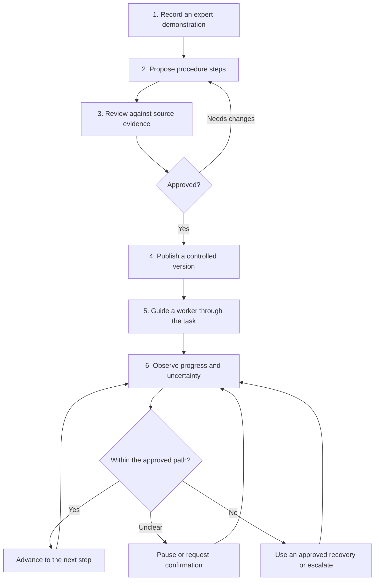

# How Vision CoDev works

This document provides a public product-level description of the system. It
intentionally omits source code, model configuration, security-sensitive
details, infrastructure topology, and proprietary implementation techniques.

## The lifecycle

## 1. Capture an expert demonstration

An experienced operator performs the procedure while a camera records the
work. The capture should reflect the real environment closely enough to show
the objects, actions, and outcomes that matter.

Good capture still requires planning. Camera position, lighting, obstructions,
audio, protective equipment, and the chosen task all affect what can be learned
and what can later be observed reliably.

## 2. Propose a structured procedure

Vision CoDev analyzes the demonstration and proposes meaningful steps. A step
can include a plain-language instruction, its place in the sequence, relevant
visual evidence, and conditions that help distinguish completion from an
uncertain or incorrect state.

The proposal is a starting point. Automated analysis does not itself make a
procedure authoritative.

## 3. Review and approve

An authorized reviewer checks each proposed step against the recording. They
can correct wording, adjust boundaries, reject weak evidence, and decide which
deviations or recovery actions are acceptable.

Once approved, the procedure becomes a controlled version. Later improvements
should produce a new version rather than silently changing instructions already
in use.

## 4. Guide live work

During a guided session, the worker receives the current instruction through an
appropriate interface. Depending on the deployment, guidance may be visual,
spoken, or both.

The live observation is interpreted in the context of the current approved
step. The system is intended to focus on what is relevant now rather than make
an unrestricted judgment about the entire scene.

## 5. Handle uncertainty and deviations

Real environments are messy. A blocked camera, unfamiliar object, ambiguous
movement, or poor connection should not be treated as proof of an error.

The guidance policy therefore needs more than “right” and “wrong.” It may:

- continue when the evidence supports progress;
- wait for a clearer observation;
- ask the worker to confirm something;
- replay or clarify the current instruction;
- offer an expert-approved recovery action; or
- stop and escalate when safe guidance is unavailable.

## 6. Learn through controlled review

Session outcomes can reveal unclear instructions, recurring deviations, or
conditions that the original demonstration did not cover. Those findings can
inform a reviewed update to the procedure and future evaluation data.

This is a controlled improvement loop—not automatic self-authorization.

## System responsibilities

| Area | Responsibility |
| --- | --- |
| Capture experience | Record and transmit the relevant view of the work |
| Procedure workspace | Organize evidence and support expert review |
| Approved procedure | Hold versioned steps, rules, and recovery guidance |
| Live guidance | Present instructions and interpret current progress |
| Governance | Control access, approval, retention, and audit expectations |

These responsibilities explain the working product without disclosing its
private software architecture.

## How success should be measured

No single score establishes that a guided procedure works. Evaluation should
consider, at minimum:

- whether important steps are captured accurately;
- whether supporting evidence points to the correct moment;
- whether progress and deviations are recognized consistently;
- how often the system is uncertain or interrupts unnecessarily;
- how quickly and safely a worker recovers;
- end-to-end response time during live use; and
- whether workers complete the real task correctly.

Results should be reported for a defined procedure, environment, hardware
setup, and participant group. Performance in one workflow should not be assumed
to transfer automatically to another.
